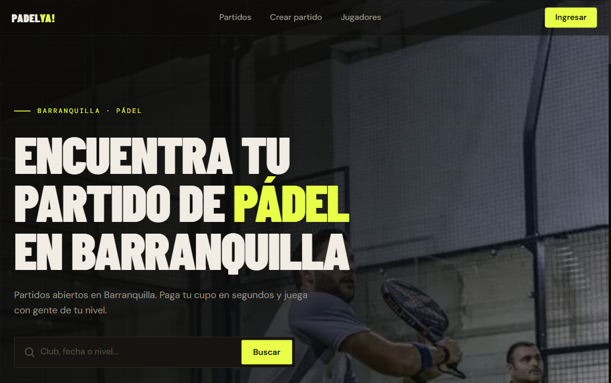

# PadelYa 🎾

**PadelYa matches padel players by level and books their courts — so you never miss a game.**

Padel is 2-on-2: you need exactly four people, and beginners rarely have three others at their level ready to play. PadelYa fills the match with players near your level and handles the court booking.

🔗 **Live:** [padelya.co](https://padelya.co)



## Status

Live with real users, 4 months in, part-time:

- **34** active users
- **~25** matches played
- Incorporated in Colombia (SPORTYA S.A.S.), **$250** pre-seed from an angel

## What it does

- Matches players by skill level and availability into a full 4-player game
- Books courts through an integration with the **easycancha** booking platform
- Charges a small fee per player on top of the booking

## Architecture

```
player request → matching (services/matches, services/players)
               → court availability + booking (services/venue-portal → easycancha API)
               → pricing/fee + payment (services/pricing, services/payments)
               → Supabase (Postgres + auth + RLS)
```

The matching logic and the easycancha integration are the two pieces with the most real-world edge cases — see `services/matches` and `services/venue-portal` for the tradeoffs (stale availability, timeouts, level-band boundaries).

## Tech stack

- **Next.js** (App Router) + **TypeScript**
- **Supabase** (Postgres + auth + RLS) — see `supabase/`
- Integrations & business logic in `services/`; shared code in `lib/` and `hooks/`
- **Vitest** test suite in `tests/`

## Getting started

```bash
npm install
# add your Supabase + integration keys to .env.local
npm run dev
```

Then open http://localhost:3000.

## Project structure

```
app/          Next.js routes (App Router)
components/   UI components
services/     integrations (easycancha) & business logic
lib/ hooks/   shared utilities & React hooks
supabase/     schema & client
tests/        Vitest tests
docs/         product & design notes
```

---
Built by [Mateo Pirela](https://github.com/mateopirela) · [mateo-five.vercel.app](https://mateo-five.vercel.app)
